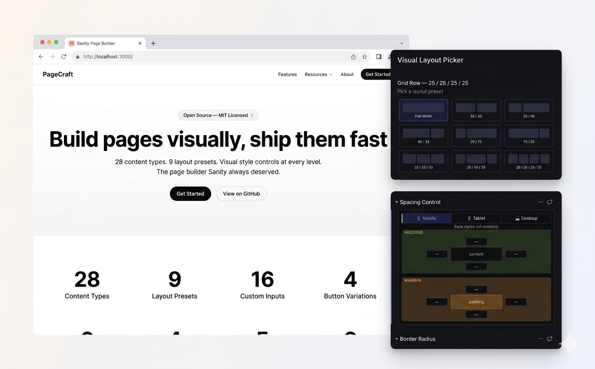

# Sanity Page Builder

The most complete open-source page builder template for **Sanity + Next.js**.

26 content blocks, 16 custom studio inputs, drag-and-drop grid layout, full visual editing.



## Structure

```
├── studio/       Sanity Studio (standalone, port 3333)
├── frontend/     Next.js app (port 3000)
└── package.json  root workspace orchestrator
```

## Getting Started

### 1. Install dependencies

```bash
npm install
```

### 2. Set up environment variables

```bash
cp studio/.env.example studio/.env
cp frontend/.env.example frontend/.env
```

Fill in your Sanity project ID and dataset in both `.env` files.

### 3. Seed demo data (optional)

```bash
npm run seed
```

### 4. Start development

```bash
npm run dev
```

- **Frontend:** [http://localhost:3000](http://localhost:3000)
- **Studio:** [http://localhost:3333](http://localhost:3333)

## Content Blocks

Hero Section, Grid Row, Call to Action, Rich Text, Image, Image Gallery, FAQ, Form, Feature Card Grid, Testimonial Carousel, Testimonial Quote, Accordion, Tabbed Content, Button Group, Icon Text, Stat Metric, Pricing Card, Alert Notice, Code Block, Data Table, Social Embed, Logo Row, Map Embed, Countdown Timer, Lottie Animation, Spacer/Divider, Table of Contents.

## Deployment

### Studio

```bash
npm run deploy:studio
```

### Frontend

Deploy the `frontend/` directory to Vercel, Netlify, or any Node.js host.

Set the **Root Directory** to `frontend` in your hosting provider.

### Validate Template

```bash
npm run validate
```

Ensures the Sanity CLI can properly read your template configuration.

## More Info

- [Create your own Sanity template](https://www.sanity.io/docs/create-your-own-sanity-template)
- [Template validator](https://github.com/sanity-io/template-validator)
- [#template-creators on Sanity Slack](https://slack.sanity.io)

## License

MIT
